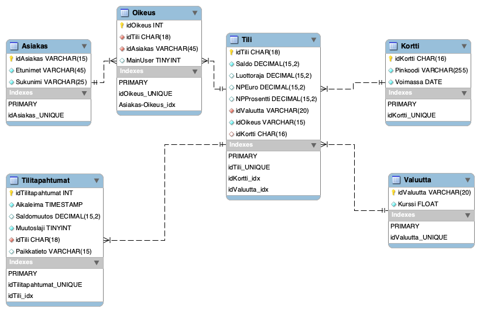
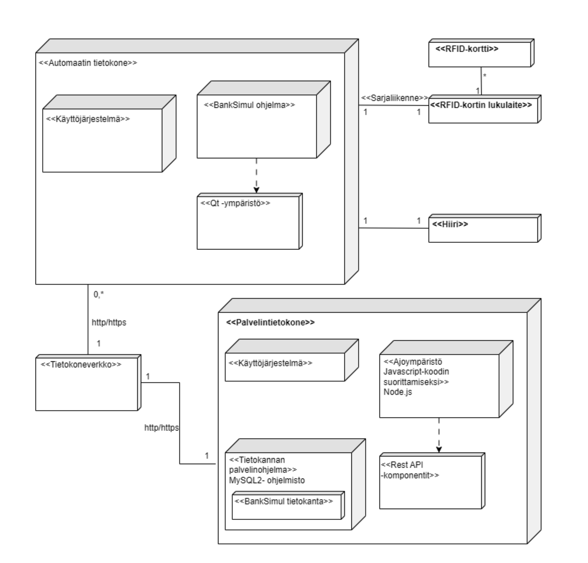

# group_9

## ER-kaavio

Projektissa käytettävän tietokannan ER-kaavio.

## Järjestelmäympäristö

Projektin järjestelmäympäristö käy ilmi alla olevasta käyttöönottokaaviosta.

## Tietokantayhteys
Luodaan tunnus, jolla sovelluksesta kytkeydytään tietokantaan.

<pre>
create user r9user@'localhost' identified by 'r9pass';
grant all on BankSimul_R9.* to r9user@'localhost'; 
</pre>