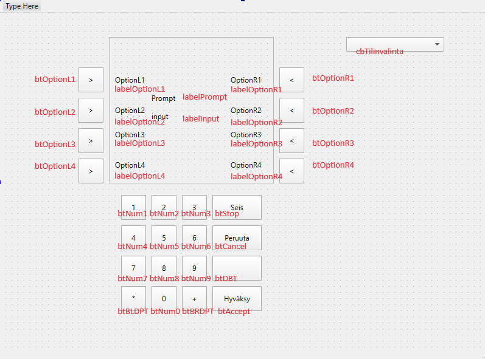

# group_9

## ER-kaavio

Projektissa käytettävän tietokannan ER-kaavio.

## Järjestelmäympäristö

Projektin järjestelmäympäristö käy ilmi alla olevasta käyttöönottokaaviosta.

<<<<<<< HEAD
<<<<<<< Updated upstream
Projektissa käytettävän tietokannan ER-kaavio.
=======
## Käyttöliittymä

Projektin käyttöliittymän pushbutton- ja labelnimeämiskartta

## Tietokantayhteys
>>>>>>> Stashed changes
=======
## Tietokantayhteys
>>>>>>> 71f68afe95df23e7576fc38d8119e0803d082745

Luodaan tunnus, jolla sovelluksesta kytkeydytään tietokantaan.

<pre>
create user r9user@'localhost' identified by 'r9pass';
grant all on BankSimul_R9.* to r9user@'localhost'; 
</pre>